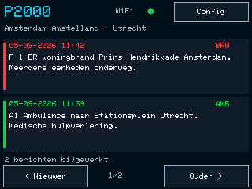

# P2000-display voor Cheap Yellow Display

Zelfstandige port van het ESP32-P2000-display naar de **ESP32-2432S032 met ESP32-WROOM**, ST7789-scherm en 320×240 pixels in liggende stand.

## Functies

- Dezelfde Alarmeringdroid-API: `https://beta.alarmeringdroid.nl/api2/find/`.
- Acht actuele meldingen in het geheugen, twee kaarten tegelijk op het scherm.
- Tik op een kaart voor de volledige melding, regio, plaats en capcodes. De detailtekst heeft grotere letters; tik op het paginanummer voor de volgende tekstpagina.
- Blader met **Nieuwer / Ouder** of veeg. De modus **Infoscherm** toont één melding tegelijk.
- Drie regiofilters, capcodefilter en afzonderlijke filters voor brandweer, politie, ambulance, lifeliner/MMT en overig. Alle regio's op **Geen** betekent geen meldingen.
- Touchconfiguratie met conceptwijzigingen, Opslaan en Annuleren, wifi-scan en toetsenbord. Dezelfde instellingen zijn via de browser beschikbaar.
- Optionele CSV-logging en een pagineerbaar SD-archief, plus formatteren met bevestiging.
- Wifi- en API-status op het scherm. Ongewijzigde inhoud wordt niet opnieuw getekend.

Dit is de port van het basisdisplay. De afzonderlijke Elecrow-kaartuitbreiding en het 800×480 SquareLine-ontwerp uit het bronproject zijn geen onderdeel van deze 320×240-firmware.



Schermvoorbeeld gerenderd met de echte UI-code op de host; geen foto van het aangesloten apparaat.

## Hardwarevariant kiezen

De **C-variant** met GT911 is op hardware getest en standaard geselecteerd. De R-variant is bouwgetest, maar nog niet op fysieke hardware gecontroleerd:

| PlatformIO-omgeving | Touchcontroller |
| --- | --- |
| `cyd_2432s032r` | XPT2046, resistief / aanraakpen |
| `cyd_2432s032c` (standaard) | GT911, capacitief |

Beide gebruiken de ST7789-configuratie uit het fabrikantvoorbeeld voor de ESP32-2432S032. De precieze printrevisie van het aangesloten bord is niet uitgelezen. Zie [hardware en bronnen](docs/hardware.md) voor pinnen en kalibratie.

## Bouwen en flashen in Visual Studio Code

1. Open deze map in **Visual Studio Code** en installeer de aanbevolen **PlatformIO IDE**-extensie.
2. Kies bij PlatformIO de juiste omgeving,.
3. Sluit de CYD met USB aan. Sluit een andere seriële monitor voordat je uploadt.
4. Kies **Upload** voor de passende PlatformIO-omgeving. PlatformIO detecteert de seriële poort automatisch; stel zo nodig `upload_port` in.
5. Open de monitortaak op 115200 baud. De firmware meldt model, touchvariant en firmwareversie bij het starten.

Terminalcommando's, vanuit deze projectmap:

```sh
pio run -e cyd_2432s032c
pio run -e cyd_2432s032c -t upload
pio device monitor --baud 115200
```

Voor een ander bord met resistieve touch vervang je `cyd_2432s032c` door `cyd_2432s032r`.

De firmwarebestanden staan na het bouwen in `.pio/build/<omgeving>/firmware.bin`. Upload met PlatformIO zodat bootloader, partitietabel en applicatie op de juiste adressen worden geschreven. De 4 MB flashindeling gebruikt `huge_app.csv`; deze uitvoering heeft geen OTA-updatefunctie.

## Eerste start

Het scherm werkt ook tijdens de eerste wifi-configuratie. Verbind je telefoon of computer met **P2000-display** en open **http://192.168.77.1**. Stel wifi, ten minste één regio en eventueel capcodes in. Via **Config → WiFi → Handmatig** kan dit ook op het scherm.

Na verbinding met je router staat het IP-adres onder **Config → WiFi**. Open dat adres in een browser om de instellingen aan te passen. Laat het wachtwoordveld in de webpagina leeg om het bestaande wachtwoord te behouden. Wijzigingen via het touchscreen worden pas actief na **Opslaan**.

Bij verkeerde wifi-instellingen blijft het touchscreen beschikbaar om de netwerknaam en het wachtwoord te corrigeren. Op het R-model staat **Touch kalibreren** op de configuratiepagina. Raak daarbij achtereenvolgens beide kruisen aan; de kalibratie blijft na herstart bewaard.

## SD-archief

Gebruik een FAT32-geformatteerde microSD-kaart en schakel **SD / archief → Meldingen opslaan** in. Het bestand is `/p2000.csv`. Nieuwe meldingen worden oudste eerst geschreven, zodat het archief bij teruglezen de nieuwste eerst toont. Je opent het via het configuratiemenu of door voorbij de oudste actuele melding te bladeren.

Het archief wordt per acht berichten ingelezen. Formatteren vereist een tweede tik op **Ja, wis alles** en wist alle bestanden op de kaart. De logging dedupliceert tegen de actuele lijst; na een herstart kunnen eerder ontvangen meldingen opnieuw in het log verschijnen, zoals bij het oorspronkelijke project.

## Geheugen en netwerk

De port gebruikt geen PSRAM of volledig schermframebuffer. De JSON-response wordt rechtstreeks uit de HTTP-stream gelezen en krijgt een geheugenlimiet van 64 KiB. Bij ongeldige, afgebroken of te grote JSON blijven de vorige meldingen behouden en verschijnt een foutstatus.

API-aanvragen worden gepauzeerd zolang de configuratie openstaat. Tijdens een netwerkrequest op het meldingenscherm kan bediening tijdelijk wachten op de netwerk-time-out. De webserver en instellingen lopen op dezelfde taak, zodat webwijzigingen en touchwijzigingen elkaar niet gelijktijdig overschrijven.

De overgenomen HTTPS-instelling gebruikt `setInsecure()` en controleert dus geen servercertificaat. Het lokale configuratieportaal heeft geen authenticatie. Gebruik dit op je eigen vertrouwde netwerk.

## Wifi- en API-diagnostiek (firmware 1.0.1)

De netwerkscan wacht nu na het verbreken van de verbinding, onderdrukt automatisch herverbinden tijdens de scan en probeert een geweigerde start maximaal drie keer. Een scanfout wordt apart getoond van een geslaagde scan zonder gevonden netwerken. De ESP32-WROOM zoekt 2.4 GHz-netwerken.

De router levert via DHCP het IP-adres, de gateway en DNS. HTTPS gebruikt een TLS-handshake-time-out van 12 seconden en socket/HTTP-time-outs van 8 seconden. HTTP/1.1-antwoorden worden, indien nodig, ontdaan van hun chunkcodering voordat ArduinoJson ze leest. Dit volgt de [ArduinoJson-instructie voor HTTPClient en ChunkDecodingStream](https://arduinojson.org/v7/how-to/use-arduinojson-with-httpclient/).

De seriële log vermeldt verbindingsverlies met reden, scanresultaat, HTTP-status, TLS-fout en JSON-uitkomst. Wachtwoorden worden niet gelogd. De pagina `/diagnostics` op het IP-adres van de CYD geeft dezelfde actuele status als JSON.

Via de seriële monitor op 115200 baud zijn drie commando's beschikbaar (afsluiten met Enter):

- `status`: toont de netwerk- en API-status.
- `scan`: opent de netwerkscan en zoekt naar accesspoints.
- `api`: keert terug naar de meldingenlijst en plant direct een API-aanvraag zodra wifi verbonden is.

Firmware 1.0.1 is op een C-variant getest: de scan vond 21 accesspoints, wifi herstelde na de scan en de API leverde HTTP 200 met meldingen. Ook na een herstart werkte de API. Tijdelijke fouten worden automatisch opnieuw geprobeerd. Zie [het testverslag](docs/verification.md).

## Verificatie

```sh
pio run -e cyd_2432s032r -e cyd_2432s032c
python3 tests/run_host.py
python3 tests/run_parser.py
```

De hosttests vereisen een C++17-compiler en Python 3, en gebruiken de libraries die PlatformIO bij de build installeert. Ze voeren de echte UI-code en parser uit met een gesimuleerde teken- en netwerklaag. De UI-test controleert schermgrenzen, overlappende knoppen, opslaan/annuleren, tekstomloop en het einde van het archief. De parsertest controleert filters, numerieke velden, ongeldige/te grote JSON, logvolgorde en de geheugenlimiet.

De tests maken schermvoorbeelden in `tests/.build/`. Ze vervangen geen hardwaretest. De C-variant is via USB geflasht en de wifi-scan, API-verbinding en herstart zijn gecontroleerd. De gebruiker heeft bevestigd dat de firmware werkt. De R-variant en alle SD-functies moeten nog afzonderlijk op hardware worden gecontroleerd.
