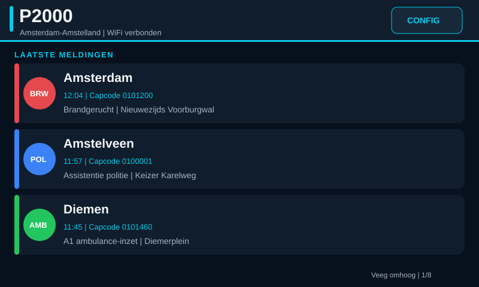

# P2000 op een Elecrow ESP32-S3 5-inch display

**Nederlands** | [English](README_EN.md)

Dit PlatformIO-project toont de laatste acht P2000-meldingen op het 800×480-scherm en biedt een instellingenpagina op de ESP32.

De schermweergave gebruikt de donkere SquareLine-ontwerpstijl rechtstreeks via Arduino_GFX. Daardoor blijven de bestaande P2000-, WiFi-, touch- en SD-functies behouden en is geen afzonderlijke LVGL/SquareLine-export nodig om deze firmware te flashen.



Om zichtbaar flikkeren te beperken bewaart de renderer een inhoudssignatuur per bovenbalk, meldingskaart en voettekst. Een ongewijzigde API-response veroorzaakt geen tekenactie; bij veranderingen wordt alleen het betreffende schermvlak vernieuwd. Een volledig scherm wordt uitsluitend bij een echte schermwissel opnieuw opgebouwd.

## Bouwen en flashen

1. Open deze map met PlatformIO in VS Code.
2. Sluit de ESP32-S3 met USB aan en kies **Upload**.
3. Verbind na de eerste start met wifi-netwerk `P2000-display` en open `http://192.168.77.1`.
4. Sla wifi, regio en capcodes op. De API-URL staat standaard op Alarmeringdroid. Daarna is de pagina bereikbaar op het IP-adres dat de router aan de ESP32 geeft.

## Alarmeringdroid-API

Standaard gebruikt de firmware:

```
https://beta.alarmeringdroid.nl/api2/find/
```

De endpoint retourneert een object met een array `meldingen`. Er zijn drie regiofilters; een melding wordt getoond wanneer zijn `regioid` met minstens één geselecteerde regio overeenkomt. De optie **Geen** schakelt alleen die keuze uit. Staan alle drie op **Geen**, dan toont het scherm geen meldingen. Capcodes worden vergeleken met de `capcodes`-array van iedere melding.

Een melding bevat onder andere `datum`, `tijd`, `tekstmelding`, `regioid`, `capstring` en een `capcodes`-array. De firmware kan ook de alternatieve veldnamen `time`, `text`, `body` en `description` lezen.

## Bediening

Veeg op het scherm omhoog voor oudere meldingen en omlaag om terug te gaan. De teller rechtsboven toont de positie in de huidige lijst. Tik rechtsboven op **CONFIG** om de drie regio’s rechtstreeks op het scherm te kiezen. Tik op `<` of `>` naast een regio. Gebruik **Scan WiFi** om een netwerk te kiezen wanneer je wifi opnieuw wilt instellen. Gebruik **Handmatig** wanneer de scan geen resultaten geeft: vul SSID en wachtwoord rechtstreeks op het scherm in met het touch-toetsenbord en tik op **Opslaan**. De eerste configuratie zonder opgeslagen wifi gebruikt nog steeds toegangspunt **P2000-display** op `192.168.77.1`. In hetzelfde menu wissel je **Weergave** tussen de meldingenlijst en **Infoscherm – 1 kanaal**. Met **SD-kaart logging** schakel je CSV-logging van nieuwe meldingen naar `/p2000.csv` op een FAT32-geformatteerde microSD-kaart in of uit. **Formatteer SD** wist alle bestanden en maakt de kaart opnieuw als FAT-bestandssysteem klaar; de tweede bevestiging voorkomt een onbedoelde wisactie. Die modus toont één melding per scherm, met regio, plaats en volledige melding; veeg links/rechts om tussen meldingen te wisselen. Het gekozen bericht blijft in beeld bij verversen en wisselt alleen automatisch wanneer de API een nieuw bericht terugstuurt. Tik daarna op **Opslaan**. De GT911-touchcontroller gebruikt I²C op GPIO19 (SDA) en GPIO20 (SCL).

Via **Dienstenfilter** kunnen Brandweer, Politie, Ambulance, Lifeliner/traumaheli en overige meldingen afzonderlijk worden in- of uitgeschakeld. Dezelfde filters staan op de webconfiguratie en blijven na een herstart bewaard.

## SquareLine Studio

De bewerkbare 800×480-layout staat in [`squareline/P2000.spj`](squareline/P2000.spj). Laat `P2000.sll` in dezelfde map staan wanneer je het project in SquareLine Studio opent.

De displayconfiguratie is afgestemd op de Elecrow **DIS07050H/CrowPanel 5.0"** (ESP32-S3-WROOM-1-N4R8, 800×480). De gebruikte RGB-pinconfiguratie komt overeen met de door Elecrow-gebruikers bevestigde Arduino_GFX-configuratie. Vergelijk dit alsnog met de pinout als uw print een andere revisie heeft.

HTTPS-certificaten worden bewust niet gevalideerd (`setInsecure()`), zodat publieke endpoints zonder certificaatbeheer werken. Gebruik bij voorkeur een vertrouwde API en alleen een netwerk dat u beheert.
